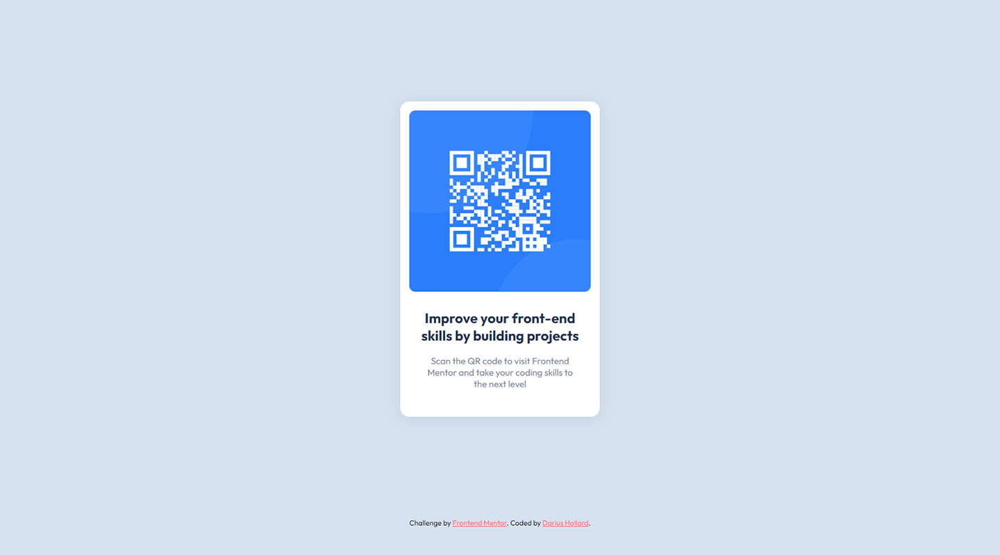

# Frontend Mentor - QR code component solution

This is a solution to the [QR code component challenge on Frontend Mentor](https://www.frontendmentor.io/challenges/qr-code-component-iux_sIO_H).

I built this one just to test out their workflow logic from start to finish, through a super simple challenge.

## Table of contents

- [Overview](#overview)
  - [Target](#target)
  - [Try it out](#try-it-out)
- [My process](#my-process)
  - [Built with](#built-with)
  - [What I learned](#what-i-learned)
- [Author](#author)

## Overview

### Target

The challenge was to create a qr code component using specified colors and fonts to achieve the look seen above.

#### Result preview

### Try it out

- Interact with the result here: [https://dhollard.github.io/practice-qrcode-component-card/](https://dhollard.github.io/practice-qrcode-component-card/)

## My process

### Built with

- HTML
- CSS (flexbox, variables for clarity)

### What I learned

How to handle a Frontend Mentor challenge from start to finish.

## Author

- Website - [darius-hollard.com](https://www.your-site.com)
- Frontend Mentor - [@dhollard](https://www.frontendmentor.io/profile/dhollard)
